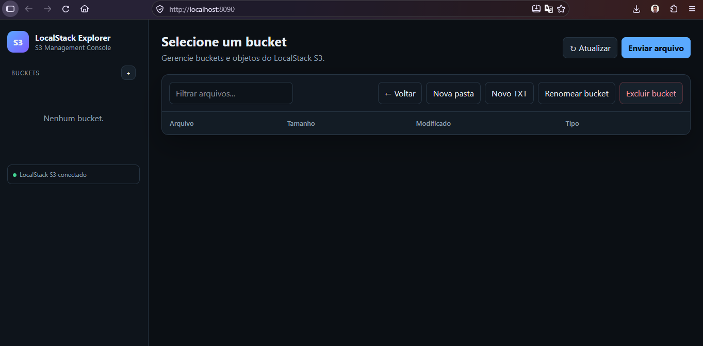

# 📌 S3 Explores
[](https://github.com/tvlemes/localstack_dynamodb/blob/main/LICENSE)

[]()



---

## 🎯 Objetivos 

Houve a necessidade de criar uma interface gráfica para trabalhar com o emulador do *S3 Localstack*, para agilizar o processo de desenvolvimento

---

## 📁 Estrutura considerada

A estrutura utilizada como referência é:

```text
s3_explore/
│
├── backend/
│   └── main.py
│
├── frontend/
│   └── index.html
│
├── Dockerfile
│
├── docker-compose.yml
│
├── requirements.txt
│
└── README.md
```

---

## 🪣 LocalStack

O serviço LocalStack possui a seguinte configuração:
```yaml
localstack:
  image: localstack/localstack:latest
  container_name: electoral-localstack
  ports:
    - "${LOCALSTACK_PORT}:4566"
  environment:
    - PERSISTENCE=1
  volumes:
    - localstack_data:/var/lib/localstack
  networks:
    - electoral-network
```

O endpoint utilizado pelo Explorer é:
```yaml
http://localstack:4566
```

---

## 🌐 S3 Explorer

A configuração discutida para o serviço é:

```yaml
s3-explorer:
  image: s3-explorer:latest
  container_name: electoral-s3-explorer
  ports:
    - "8090:8003"
  environment:
    - S3_ENDPOINT_URL=http://localstack:4566
    - AWS_ACCESS_KEY_ID=test
    - AWS_SECRET_ACCESS_KEY=test
    - AWS_DEFAULT_REGION=us-east-1
  depends_on:
    - localstack
  networks:
    - electoral-network
```

A interface é acessada em:
```yaml
http://localhost:8090
```
---

## 👨‍💻 Autor

**Thiago Vilarinho Lemes**\
💻 Engenheiro e Analista de Dados.\
🏠 Home: https://thiagolemes.netlify.app/ \
🔗 LinkedIn: <a href="https://www.linkedin.com/in/thiago-v-lemes-b1232727" target="_blank">Thiago Lemes</a><br>
✉️ e-mail:contatothiagolemes@gmail.com | lemes_vilarinho@yahoo.com.br


Principais áreas:

```text
Data Engineering
Docker
Kafka
Python
SQL
Apache Airflow
Docker
PostgreSQL
Data Lake
ETL
APIs
Cloud
IoT
Machine Learning
Generative AI
```